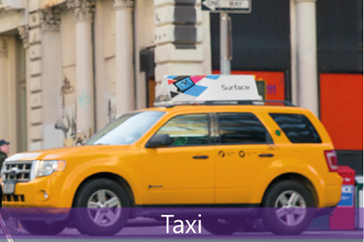
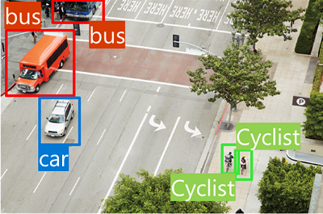
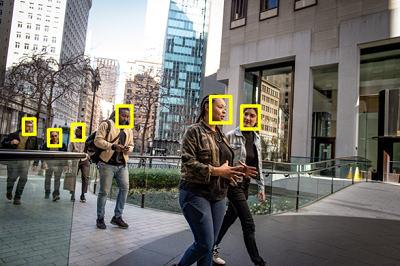

# Fundamental AI Concepts

> With AI, we can build solutions that seemed like science fiction a short time ago; enabling incredible advances in health care, financial management, environmental protection, and other areas to make a better world for everyone.

## What is AI?
Simply put, **AI is software that imitates human behaviors and capabilities**. Key workloads include:

- **Machine learning** \
This is often the foundation for an AI system, and is the way we "teach" a computer model to make predictions and draw conclusions from data.
- **Computer vision** \
Capabilities within AI to interpret the world visually through cameras, video, and images.
- **Natural language processing** \
Capabilities within AI for a computer to interpret written or spoken language, and respond in kind.
- **Document intelligence** \
Capabilities within AI that deal with managing, processing, and using high volumes of data found in forms and documents.
- **Knowledge mining** \
Capabilities within AI to extract information from large volumes of often unstructured data to create a searchable knowledge store.
- **Generative AI** \
Capabilities within AI that create original content in a variety of formats including natural language, image, code, and more.

## Machine Learning
Machine Learning is the foundation for most AI solutions. Since the 1950's, researchers, often known as data scientists, have worked on different approaches to AI. Most modern applications of AI have their origins in machine learning, a branch of AI that combines computer science and mathematics.

### How machine learning works
> Machines learn from data.

In today's world, we create huge volumes of data as we go about our everyday lives. From the text messages, emails, and social media posts we send to the photographs and videos we take on our phones, we generate massive amounts of information. More data still is created by millions of sensors in our homes, cars, cities, public transport infrastructure, and factories.

Data scientists can use all of that data to train machine learning models that can make predictions and inferences based on the relationships they find in the data.

Machine learning models try to capture the relationship between data.

### Machine learning in Microsoft Azure
Microsoft Azure provides the Azure Machine Learning service - a cloud-based platform for creating, managing, and publishing machine learning models. Azure Machine Learning Studio offers multiple authoring experiences such as:

- **Automated machine learning:** this feature enables non-experts to quickly create an effective machine learning model from data.
- **Azure Machine Learning designer:** a graphical interface enabling no-code development of machine learning solutions.
- **Data metric visualization:** analyze and optimize your experiments with visualization.
- **Notebooks:** write and run your own code in managed Jupyter Notebook servers that are directly integrated in the studio.

## Computer Vision
Computer Vision is an area of AI that deals with visual processing. 

### Computer Vision models and capabilities
Most computer vision solutions are based on machine learning models that can be applied to visual input from cameras, videos, or images. The following table describes common computer vision tasks.

| Task | Description |
|---|---|
| Image classification |    Image classification involves training a machine learning model to classify images based on their contents. |
| Object detection |    Object detection machine learning models are trained to classify individual objects within an image, and identify their location with a bounding box. |
| Semantic segmentation |    Semantic segmentation is an advanced machine learning technique in which individual pixels in the image are classified according to the object to which they belong.  |
| Image analysis |    You can create solutions that combine machine learning models with advanced image analysis techniques to extract information from images, including "tags" that could help catalog the image or even descriptive captions that summarize the scene shown in the image. |
| Face detection, analysis, and recognition|    Face detection is a specialized form of object detection that locates human faces in an image. This can be combined with classification and facial geometry analysis techniques to recognize individuals based on their facial features. |
| Optical character recognition (OCR)|    Optical character recognition is a technique used to detect and read text in images. You can use OCR to read text in photographs (for example, road signs or store fronts) or to extract information from scanned documents such as letters, invoices, or forms. |

### Computer vision services in Microsoft Azure
Microsoft's Azure AI Vision can be used to develop computer vision solutions. The service features are available for use and testing in the Azure Vision Studio and other programming languages. Some features of Azure AI Vision include:

- **Image Analysis:** capabilities for analyzing images and video, and extracting descriptions, tags, objects, and text.
- **Face:** capabilities that enable you to build face detection and facial recognition solutions.
- **Optical Character Recognition (OCR):** capabilities for extracting printed or handwritten text from images, enabling access to a digital version of the scanned text.

## Natural Language Processing
Natural language processing (NLP) is the area of AI that deals with creating software that understands written and spoken language.

NLP enables you to create software that can:

- Analyze and interpret text in documents, email messages, and other sources.
- Interpret spoken language, and synthesize speech responses.
- Automatically translate spoken or written phrases between languages.
- Interpret commands and determine appropriate actions.

### NLP in Microsoft Azure
**Microsoft Azure AI Language** features include: 
- Understanding and analyzing text
- Training conversational language models that can understand spoken or text-based commands
- Building intelligent applications

**Microsoft Azure AI Speech** features include:
- Speech recognition and synthesis
- Real-time translations
- Conversation transcriptions

Tools:
- Azure Language Studio for Azure AI Language features
- Azure Speech Studio for Azure AI Speech features

## Document Intelligence
Document Intelligence is the area of AI that deals with managing, processing, and using high volumes of a variety of data found in forms and documents. 

### Document intelligence in Microsoft Azure
Use Microsoft Azure AI Document Intelligence to build solutions that manage and accelerate data collection from scanned documents. 

Azure AI Document Intelligence features:
- Automate document processing in applications and workflows
- Enhance data-driven strategies
- Enrich document search capabilities.

You can use prebuilt models to add intelligent document processing for invoices, receipts, health insurance cards, tax forms, and more. 

> You can also use Azure AI Document Intelligence to create custom models with your own labeled datasets. 

The service features are available for use and testing in the **Document Intelligence Studio** and other programming languages.

### Knowledge Mining
Knowledge mining is the term used to describe solutions that involve extracting information from large volumes of often unstructured data to create a searchable knowledge store.

### Knowledge mining in Microsoft Azure
One Microsoft knowledge mining solution is Azure AI Search, a private, enterprise, search solution that has tools for building indexes. The indexes can then be used for internal-only use, or to enable searchable content on public facing internet assets.

Azure AI Search can utilize the built-in AI capabilities of Azure AI services such as image processing, document intelligence, and natural language processing to extract data. The product's AI capabilities makes it possible to index previously unsearchable documents and to extract and surface insights from large amounts of data quickly.

## Generative AI
Generative AI describes a category of capabilities within AI that **create original content**. 

People typically interact with generative AI that has been built into chat applications. Generative AI applications take in natural language input, and return appropriate responses in a variety of formats including natural language, image, code, and audio.

### Generative AI in Microsoft Azure
Use the Azure OpenAI service to build generative AI solutions. Azure OpenAI Service is Microsoft's cloud solution for deploying, customizing, and hosting generative AI models. It brings together the best of OpenAI's cutting edge models and APIs with the security and scalability of the Azure cloud platform.

Azure OpenAI supports many foundation model choices that can serve different needs. The service features are available for use and testing in the **Azure OpenAI Studio** and other programming languages. You can use the Azure OpenAI Studio user interface to manage, develop, and customize generative AI models.

### Challenges and risks with AI
Artificial Intelligence is a powerful tool that can be used to greatly benefit the world. It must be used responsibly.

> With great power comes great responsibility

The following table shows some of the potential challenges and risks facing an AI application developer.

| Challenge or Risk | Example |
|---|---|
| Bias can affect results | A loan-approval model discriminates by gender due to bias in the data with which it was trained|
| Errors may cause harm | An autonomous vehicle experiences a system failure and causes a collision |
| Data could be exposed | A medical diagnostic bot is trained using sensitive patient data, which is stored insecurely |
| Solutions may not work for everyone | A home automation assistant provides no audio output for visually impaired users |
| Users must trust a complex system | An AI-based financial tool makes investment recommendations - what are they based on? |
| Who's liable for AI-driven decisions? | An innocent person is convicted of a crime based on evidence from facial recognition – who's responsible? |

## Responsible AI
At Microsoft, AI software development is guided by a set of six principles, designed to ensure that AI applications provide amazing solutions to difficult problems without any unintended negative consequences.

- **Fairness** \
AI systems should treat all people fairly. Azure Machine Learning capabilities helps data scientists and developers identify and mitigate bias in the model.
- **Reliability and Safety** \
AI systems should perform reliably and safely. AI-based software application development must be subjected to rigorous testing and deployment management processes to ensure that they work as expected before release.
- **Privacy and Security** \
AI systems should be secure and respect privacy. Both the data and decisions made from the data may be subject to privacy or security concerns.
- **Inclusiveness** \
AI systems should empower everyone and engage people. AI should bring benefits to all parts of society, regardless of physical ability, gender, sexual orientation, ethnicity, or other factors.
- **Transparency** \
AI systems should be understandable. Users should be made fully aware of the purpose of the system, how it works, and what limitations may be expected.
- **Accountability** \
People should be accountable for AI systems. Designers and developers of AI-based solutions should work within a framework of governance and organizational principles that ensure the solution meets ethical and legal standards that are clearly defined.

