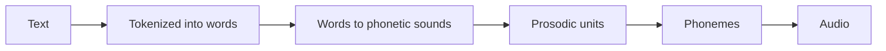

# Azure AI Speech
Azure AI Speech facilitates recognition and synthesis of speech.

## Intro
AI Speech capabilities include understanding voice instructions, getting answers for spoken questions, and generating captions. To do this, the system needs to support:
- **Speech recognition** - the ability to detect and interpret spoken input
- **Speech synthesis** - the ability to generate spoken output

> Azure AI Speech provides **speech to text and text to speech** capabilities 

Resource: [Azure AI Speech](https://learn.microsoft.com/en-us/azure/ai-services/speech-service/)

## Speech recognition and synthesis
**Speech recognition** takes the spoken word and converts it into data (usually `transcribed into text`) that can be processed. 

Speech recognition software uses multiple models:
- **Acoustic model**: converts audio signal into phonemes (representations of specific sounds).
- **Language model**: maps phonemes to words 
    - Using a statistical algorithm that predicts the most probable sequence of words based on the phonemes.

The recognized words are typically converted to text. Example outputs include:
- Closed captions for recorded or live videos
- Transcript of a phone call or meeting
- Automated note dictation
- Determining intended user input for further processing

**Speech synthesis** is the vocalization of data, converting text to speech. 

Speech synthesis software needs:
- Text to be spoken
- Voice to be used 

**Steps to synthesize speech:**

Speech synthesis uses:
- Generating spoken responses to user input
- Creating voice menus for phone systems
- Reading email or text messages (hands-free)
- Broadcasting announcements in public locations

## Speech on Azure
Azure provides the **Azure AI Speech service** which includes:
- Speech to text API
    - Real-time or batch transcription
    - Audio file or real-time (live/microphone) source
    - Language models
        - Default `Universal Language Model` trained by Microsoft
            - Optimized for conversational and dictation scenarios
        - Can create/train custom models including acoustics, language, and pronunciation
- Text to speech API
    - Convert text input to audible speech
    - To be played directly or saved to a file
    - Voices
        - Multiple pre-defined voices 
        - Support for multiple languages and regional pronunciation
        - `Neural voices` leveraging neural networks to improve intonation for a more natural sounding voice
        - Custom voices
