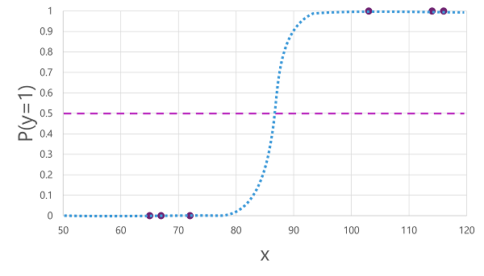
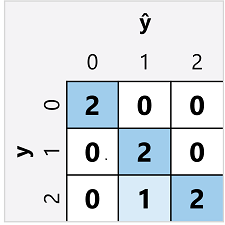

# Machine Learning
Machine learning is the basis for most modern artificial intelligence solutions. 

Machine learning is in many ways the intersection of two disciplines - data science and software engineering. 

> The goal of machine learning is to use data to create a predictive model that can be incorporated into a software application or service. 

To achieve this goal requires collaboration where:
- **Data scientists** explore and prepare the data before using it to train a machine learning model
- **Software developers** who integrate the models into applications where they're used to predict new data values

> **Inferencing:** Use models to predict new values

## Machine Learning Process
Machine Learning is broken down into three steps:
1. **Infer/Predict** \
In chess, you predict the best move and make the move.
1. **Error/Loss** \
In chess, you evaluate how good or bad the move was.
1. **Train/Learn** \
In chess, you update you model (change the weights) to improve the next move.

## Types of Machine Learning
A breakdown of common types of machine learning is shown in the following diagram.


### Supervised Machine Learning
Supervised machine learning involves machine learning algorithms in which the training data includes both **feature values** and **known label values**.

Supervised machine learning is used to train models by determining a ___relationship___ between the features and labels in ___past observations___, so that unknown labels can be ___predicted___ for features in future cases.

#### Regression
Regression is a form of supervised machine learning in which the label predicted by the model is a numeric value. For example:

- The number of ice creams sold on a given day, based on the temperature, rainfall, and windspeed.
- The selling price of a property based on its size in square feet, the number of bedrooms it contains, and socio-economic metrics for its location.
- The fuel efficiency (in miles-per-gallon) of a car based on its engine size, weight, width, height, and length.

#### Classification
Classification is a form of supervised machine learning in which the ___label represents a categorization___, or class. There are two common classification scenarios.

1. **Binary classification** \
In binary classification, the label determines whether the observed item is (or isn't) an instance of a specific class. Or put another way, binary classification models predict one of two mutually exclusive outcomes. For example:

    - Patient's risk for diabetes based on clinical metrics like weight, age, and blood glucose level.
    - Bank customer likelihood to default based on income, credit history, and age.

    > **NOTICE**: The model predicts a binary true/false or positive/negative prediction for a single possible class.

1. **Multiclass classification** \
Multiclass classification extends binary classification to predict a label that represents one of multiple possible classes. For example:

    - Species of a animal based on its physical measurements.
    - The genre of a movie based on its cast, director, and budget.

    > **Multiclass classification** is used to predict mutually exclusive labels. However, there are also some algorithms that you can use to train multilabel classification models (e.e., categorize a movie as both science fiction and comedy).

### Unsupervised Machine Learning
Involves training models using data that consists only of feature values without any known labels. 

> The algorithms determine the relationships between the features of the observations in the training data.

#### Clustering
> Most common form of unsupervised machine learning is clustering. 

Algorithm identifies similarities between observations based on their features, and groups them into discrete clusters. For example:

- Group similar flowers based on their size, number of leaves, and number of petals.
- Identify groups of similar customers based on demographic attributes and purchasing behavior.

|  | Clustering | Multiclass Classification |
|---|---|---|
| Similarity | Categorize observations into discrete cluster labels | Categorize observations into discrete classes |
| Difference | No previously known cluster label and the algorithm groups the data observations based purely on similarity of features. | Classes known in advance. Algorithm works by determining the relationship between the features and the known classification label. |

> Clustering may be used to determine the set of classes that exist before training a classification model.

## Regression
> ___Regression models are trained___ to predict numeric label values based on training data that includes both features and known labels. 

Training involves multiple iterations in which you use an appropriate algorithm to train a model, evaluate the model's predictive performance, and refine the model by repeating the training process with different algorithms and parameters ___until you achieve an acceptable level of predictive accuracy___.


The diagram shows four key elements of the training process for supervised machine learning models:

1. Split the training data (randomly) to create a dataset with which to train the model while holding back a subset of the data that you'll use to validate the trained model.
2. Use an algorithm to fit the training data to a model. In the case of a regression model, use a regression algorithm such as linear regression.
3. Use the validation data you held back to test the model by predicting labels for the features.
4. Compare the known actual labels in the validation dataset to the labels that the model predicted. Then aggregate the differences between the predicted and actual label values to calculate a metric that indicates how accurately the model predicted for the validation data.

### Training a regression model

**Linear regression** \
Deriving a function that produces a straight line through the intersections of the x and y values while minimizing the average distance between the line and the plotted points. Example:


### Evaluating a regression model
To validate the model, use the model to predict the label for each of the observations in the dataset held back from the training set.

Plot both the predicted and actual labels against the feature values like this:


The variance is shown on the plot as a line between the $\hat{y}$ and ${y}$ values indicating how far off the prediction was from the actual value.

> **Regression variance** is the difference between the predicted $\hat{y}$ and actual ${y}$ labels.

### Regression evaluation metrics
You can evaluate a regression model by calculating common metrics, based on the differences between predicted and actual values.

**Mean Absolute Error (MAE)** \
The variance in this example indicates by how many ice creams each prediction was wrong. It doesn't matter if the prediction was over or under the actual value. This metric is ___known as the absolute error___ for each prediction, and can be summarized for the whole validation.

> Calculate the mean (average) of the absolute error values (e.g., 2, 3, 3, 1, 2, and 3 has mean 2.33).

**Mean Squared Error (MSE)** \
It may be more desirable to have a model that is consistently wrong by a small amount than one that makes fewer, but larger errors. One way to produce a metric that ___amplifies larger errors by squaring the individual errors___ and calculating the mean of the squared values. This metric is known as the mean squared error (MSE).

> Calculate the mean of the squared absolute error values (e.g., 4, 9, 9, 1, 4, and 9 has mean squared 6).

**Root Mean Squared Error (RMSE)** \
Because MSE squares the error values, the resulting metric no longer represents the quantity measured by the label. Taking the square root of the MSE will be more accurate.

> Calculate the square root of the MSE; which produces a metric called RMSE.

**Coefficient of determination (R $^{2}$)** \
In reality, there is always some natural random variance in the values. 

> In a linear regression model, the training algorithm fits a straight line that minimizes the mean variance between the function and the known label values. 

The ___coefficient of determination___ (more commonly referred to as R $^{2}$ or R-Squared) is a metric that measures the proportion of variance in the validation results that can be explained by the model.

The calculation for R $^{2}$ is more complex than for the previous metrics. It compares the sum of squared differences between predicted and actual labels with the sum of squared differences between the actual label values and the mean of actual label values, like this:

> R $^{2}$ = 1- ∑(y-ŷ)$^{2}$ ÷ ∑(y-ȳ)$^{2}$

___R $^{2}$ is a value between 0 and 1___ that describes the proportion of variance explained by the model. The closer to 1 this value is, the better the model is fitting the validation data. 

### Iterative training
In most real-world scenarios, a data scientist will use an iterative process to repeatedly train and evaluate a model, varying:

- **Feature selection and preparation** \
Choosing which features to include in the model, and calculations applied to them, helps ensure a better fit.
- **Algorithm selection** \
There are many other regression algorithms than linear regression.
- **Algorithm parameters** \
Numeric settings to control algorithm behavior, more accurately called hyperparameters, differentiate them from the x and y parameters.

> After multiple iterations, the model that results in the best evaluation metric that's acceptable for the specific scenario is selected.

## Binary Classification
Classification, like regression, is a supervised machine learning technique; and therefore follows the same iterative process of training, validating, and evaluating models. 
- Classification vs. Regression:
    - Classification: In classification, the goal is to predict discrete labels or categories for input data. For example, determining whether an email is spam or not.
    - Regression: In regression, the goal is to predict continuous numeric values. For instance, predicting the temperature based on historical data.
- Training Process:
    - Both classification and regression follow a similar iterative process:
        - Training: The model learns from labeled data during training.
        - Validation: The model's performance is evaluated using validation data.
        - Evaluation: The model's effectiveness is assessed based on metrics.
    - However, the key difference lies in what they predict:
        - Classification models predict class labels (e.g., spam or not spam).
        - Regression models predict continuous values (e.g., temperature).
- Binary Classification:
    - Binary classification deals with two possible labels (e.g., true or false).
    - Real-world scenarios often involve multiple features (x) and a binary outcome (y = 1 or 0).

### Example
There are many algorithms that can be used for binary classification, such as `logistic regression`, which derives a ___sigmoid (S-shaped) function___ with values between 0.0 and 1.0, like this:



The function produced by the algorithm describes the probability of y being true (y=1) for a given value of x. Mathematically, you can express the function like this:

> f(x) = P(y=1 | x)

The diagram also includes a horizontal line to indicate the threshold at which a model based on this function will predict true (1) or false (0). The threshold lies at the mid-point for y (P(y) = 0.5). 

> **NOTE:** \
Despite its name, in machine learning logistic regression is used for classification, not regression. The important point is the logistic nature of the function it produces, which describes an S-shaped curve between a lower and upper value (0.0 and 1.0 when used for binary classification).

### Evaluating a binary classification model
As with regression, when training a binary classification model you hold back a random subset of data with which to validate the trained model. 

Based on whether the probability calculated by the function is above or below the threshold, the model generates a predicted label of 1 or 0 for each observation. We can then compare the predicted class labels (ŷ) to the actual class labels (y).

### Binary classification evaluation metrics
The first step in calculating evaluation metrics for a binary classification model is usually to create a matrix of the number of correct and incorrect predictions for each possible class label:


This is called a confusion matrix, and it shows the prediction totals where:

ŷ=0 and y=0: True negatives (TN)
ŷ=1 and y=0: False positives (FP)
ŷ=0 and y=1: False negatives (FN)
ŷ=1 and y=1: True positives (TP)

Color-intensity is used to indicate the number of predictions in each cell, so a quick glance at a model that predicts well should reveal a deeply shaded diagonal trend.

### Accuracy
The simplest metric you can calculate from the confusion matrix is accuracy - the proportion of predictions that the model got right. 

> Accuracy (%) = (TN+TP) ÷ (TN+FN+FP+TP)

For a given set of validation data, the accuracy metric shows how a classification model produces correct predictions `Accuracy (%)` of the time.

### Recall
Recall is a metric that measures the proportion of positive cases that the model identified correctly. 

> Recall = TP ÷ (TP+FN)

### Precision
Precision is a similar metric to recall, but measures the proportion of predicted positive cases where the true label is actually positive. 

> Precision = TP ÷ (TP+FP)

### F1-score
F1-score is an overall metric that combined recall and precision. The formula for F1-score is:

> F1-score = (2 x Precision x Recall) ÷ (Precision + Recall)

### Area Under the Curve (AUC)
Another name for recall is the **true positive rate (TPR)**, and there's an equivalent metric called the **false positive rate (FPR)** that is calculated as FP÷(FP+TN).

When we adjust the threshold above which a model predicts a positive class (1), it impacts the number of positive and negative predictions. Consequently, the True Positive Rate (TPR) and False Positive Rate (FPR) metrics change. These metrics are commonly used to evaluate a model’s performance. An ___ROC (Receiver Operating Characteristic) curve___ plots the TPR against the FPR for various threshold values between 0.0 and 1.0.


The ROC curve for a perfect model would go straight up the TPR axis on the left and then across the FPR axis at the top. Since the plot area for the curve measures 1x1, the area under this perfect curve would be 1.0 (meaning that the model is correct 100% of the time). 

In contrast, a diagonal line from the bottom-left to the top-right represents the results that would be achieved by randomly guessing a binary label; producing an area under the curve of 0.5. In other words, given two possible class labels, you could reasonably expect to guess correctly 50% of the time.

## Multiclass Classification
Multiclass classification is used to predict to which of multiple possible classes an observation belongs. 

Multiclass classification algorithms are used to **calculate probability values for multiple class labels**, enabling a model to **predict the most probable class** for a given observation.

### Training a multiclass classification model
To train a multiclass classification model, use an algorithm to fit the training data to a function that calculates a probability value for each possible class. 


> The model uses a function to determine the most probable class for a given set of features (x) and predicts the corresponding class label (y).

There are two kinds of algorithm you can use to do this:
- One-vs-Rest (OvR) algorithms
- Multinomial algorithms

**One-vs-Rest (OvR) algorithms** \
One-vs-Rest algorithms train a binary classification function for each class, each calculating the probability that the observation is an example of the target class. Each function calculates the probability of the observation being a specific class compared to any other class. For our simple classification model based on one feature value, the algorithm would essentially create three binary classification functions:

```
f0(x) = P(y=0 | x)
f1(x) = P(y=1 | x)
f2(x) = P(y=2 | x)
```

Algorithms produce a sigmoid to calculate probability of a match. Classification is decided by function that produces the highest probability.

**Multinomial algorithms** \
A multinomial algorithm creates a single function that returns a multi-valued output. The output is a vector that contains the probability distribution:

> f(x) =[P(y=0|x), P(y=1|x), P(y=2|x)]

An example of this kind of function is a softmax function, which could produce an output like the following example:

> [0.2, 0.3, 0.5]

The class with the highest probability is the winner.

The confusion matrix for a multiclass classifier is similar to that of a binary classifier, except that it shows the number of predictions for each combination of predicted (ŷ) and actual class labels (y):

### Evaluating a multiclass classification model
To evaluate a multiclass classifier:
- Calculate binary classification metrics for each individual class
- Calculate aggregate metrics that take all classes into account

The confusion matrix for a multiclass classifier is similar to that of a binary classifier, except that it shows the number of predictions for each combination of predicted (ŷ) and actual class labels (y):



From this confusion matrix, we can determine the metrics for each individual class as follows:
| Class	| TP | TN | FP | FN | Accuracy | Recall | Precision | F1-Score |
|--|--|--|--|--|--|--|--|--|
| 0	| 2	| 5	| 0	| 0	| 1.0 | 1.0 | 1.0 | 1.0 |
| 1	| 2	| 4	| 1	| 0	| 0.86 | 1.0 | 0.67 | 0.8 |
| 2	| 2	| 4	| 0	| 1	| 0.86 | 0.67 | 1.0 | 0.8 |

To calculate the overall accuracy, recall, and precision metrics, you use the total of the TP, TN, FP, and FN metrics:

Overall accuracy = (13+6)÷(13+6+1+1) = 0.90
Overall recall = 6÷(6+1) = 0.86
Overall precision = 6÷(6+1) = 0.86
The overall F1-score is calculated using the overall recall and precision metrics:

Overall F1-score = (2x0.86x0.86)÷(0.86+0.86) = 0.86

## Clustering
Clustering is a form of unsupervised machine learning in which observations are grouped into clusters based on similarities in their data values, or features.

> **Unsupervised:** doesn't make use of previously known label values to train a model. 

In a clustering model, the **label is the cluster** to which the observation is assigned, **based only on its features**.

### Training a clustering model
One of the most commonly used algorithms is **K-Means clustering**, which consists of the following steps:

1. The feature (x) values are vectorized to define n-dimensional coordinates (where n is the number of features). In the flower example, we have two features: number of leaves (x1) and number of petals (x2). So, the feature vector has two coordinates that we can use to conceptually plot the data points in two-dimensional space ([x1,x2])
1. You decide how many clusters you want to use to group the flowers - call this value k. For example, to create three clusters, you would use a k value of 3. Then k points are plotted at random coordinates. These points become the center points for each cluster, so they're called centroids.
1. Each data point (in this case a flower) is assigned to its nearest centroid.
1. Each centroid is moved to the center of the data points assigned to it based on the mean distance between the points.
1. After the centroid is moved, the data points may now be closer to a different centroid, so the data points are reassigned to clusters based on the new closest centroid.
1. The centroid movement and cluster reallocation steps are repeated until the clusters become stable or a predetermined maximum number of iterations is reached.


### Evaluating a clustering model
Since there's no known labels, evaluation of a clustering model is based on how well the resulting clusters are separated from one another.

There are multiple metrics that you can use to evaluate cluster separation, including:

- **Average distance to cluster center:** How close, on average, each point in the cluster is to the centroid of the cluster.
- **Average distance to other center:** How close, on average, each point in the cluster is to the centroid of all other clusters.
- **Maximum distance to cluster center:** The furthest distance between a point in the cluster and its centroid.
- **Silhouette:** A value between -1 and 1 that summarizes the ratio of distance between points in the same cluster and points in different clusters (The closer to 1, the better the cluster separation).

## Deep Learning
Deep learning is an **advanced form of machine learning** that tries to emulate the way the human brain learns. 

The key to deep learning:
- creation of an artificial neural network 
- simulates electrochemical activity in biological neurons 
- using mathematical functions

Artificial neural networks are made up of **multiple layers of neurons** - essentially defining a **deeply nested function**. 

> The **deep**ly nested function is the reason for the name **deep** learning. The models produced are referred to as **deep** neural networks (DNNs).

Deep learning can be used for:
- regression 
- classification
- natural language processing
- computer vision

Deep learning involves fitting training data to a function that can predict a label (y) based on the value of one or more features (x). 

- The function (f(x)) is the outer layer.
- Each layer encapsulates functions that operate on x and the weight (w) values. 
- Training algorithm iteratively feeds the feature values (x) in the training data through the layers to calculate output values for ŷ.
- Validation evaluates how far off the calculated ŷ values are from the known y values (which **quantifies the level of error, or loss**, in the model).
- Modify the weights (w) to reduce the loss. 
- Trained model includes the final weight values that result in the most accurate predictions.

Deep neural network for classification


> Each neuron in a layer is connected to all of the neurons in the next layer (an architecture sometimes called a fully connected network).

### How does a neural network learn?
The weights in a neural network are central to how it calculates predicted values for labels. During training, the model learns the weights that will result in the most accurate predictions. Let's explore the training process in a little more detail to understand how this learning takes place.


1. Training and validation datasets are defined. Training features fed into input layer.
1. Neurons in each layer apply their weights (initially random) and feed data through network.
1. Output layer produces vector of calculated values for ŷ. 
1. **Loss function** compares predicted ŷ values to known y values, and aggregates the difference (known as the loss).
1. Optimization function can use differential calculus to evaluate the influence of each weight in the network on the loss, determining adjustments (up or down) to reduce overall loss. 
    > **Gradient descent approach** - each weight is increased or decreased to minimize the loss.
1. The changes to the weights are backpropagated to the layers in the network, replacing the previously used values.
1. The process is repeated over multiple iterations (known as epochs) until the loss is minimized and the model predicts acceptably accurately.

## Azure Machine Learning
Microsoft Azure Machine Learning: cloud service for training, deploying, and managing machine learning models.

Azure ML allows for lifecycle management of ML project, including:
- Exploring data and preparing it for modeling.
- Training and evaluating machine learning models.
- Registering and managing trained models.
- Deploying trained models for use by applications and services.
- Reviewing and applying responsible AI principles and practices.

### Features and capabilities of Azure Machine Learning
Azure Machine Learning provides the following features and capabilities:

- **Centralized storage and management of datasets** for model training and evaluation.
- **On-demand compute resources** on which you can run machine learning jobs, such as training a model.
- **Automated machine learning (AutoML)**, which makes it easy to run multiple training jobs with different algorithms and parameters to find the best model for your data.
- **Visual tools** to define orchestrated pipelines for processes such as model training or inferencing.
- **Integration with common machine learning frameworks** such as MLflow, which make it easier to manage model training, evaluation, and deployment at scale.
- **Built-in support for visualizing and evaluating metrics for responsible AI**, including model explainability, fairness assessment, and others.

### Provisioning Azure Machine Learning resources
Portal: Create an Azure Machine Learning workspace
Supporting resources:
- Storage accounts
- Container registries
- Virtual machines

### Azure Machine Learning studio
From the Azure Machine Learning workspace, you can use **Azure Machine Learning studio**; a browser-based portal for managing your machine learning resources and jobs.

In Azure Machine Learning studio, you can:

- Import and explore data.
- Create and use compute resources.
- Run code in notebooks.
- Use visual tools to create jobs and pipelines.
- Use automated machine learning to train models.
- View details of trained models, including evaluation metrics, responsible AI information, and training parameters.
- Deploy trained models for on-request and batch inferencing.
- Import and manage models from a comprehensive model catalog.


> Machine learning is the foundation on which artificial intelligence is built.

> Azure Machine Learning is a cloud platform for end-to-end machine learning operations