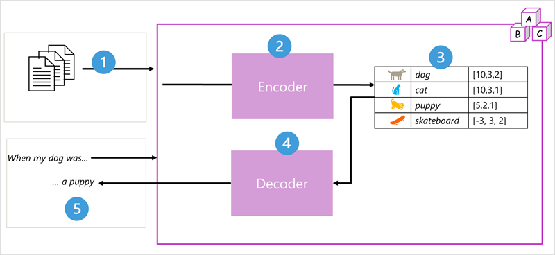

# Generative AI

**Generative AI** is a form of artificial intelligence in which models are trained to generate new original content based on natural language input. 

Not magic, just the application of mathematical techniques incrementally discovered and refined over many years of research into statistics, data science, and machine learning.

## Intro
AI imitates human behavior using ML to interact with the environment and execute tasks without explicit directions on what to output.

Generative AI generally creates original content, text or images

## Language models
Language models are a specialized type of ML models used to perform NLP tasks.

### Transformer models
Transformer models are trained with large volumes of text, enabling them to represent the semantic relationships between words and use those relationships to determine probable sequences of text that make sense. Transformer models with a large enough vocabulary are capable of generating language responses that are tough to distinguish from human responses.

Transformer model architecture consists of two components, or blocks:
- **Encoder block** creates semantic representations of the training vocabulary
- **Decoder block** generates new language sequences

**Transformer Model**: \

1. The model is trained with a large volume of natural language text, often sourced from the internet or other public sources of text.
2. The sequences of text are broken down into tokens (for example, individual words) and the encoder block processes these token sequences using a technique called attention to determine relationships between tokens (for example, which tokens influence the presence of other tokens in a sequence, different tokens that are commonly used in the same context, and so on.)
3. The output from the encoder is a collection of vectors (multi-valued numeric arrays) in which each element of the vector represents a semantic attribute of the tokens. These vectors are referred to as embeddings.
4. The decoder block works on a new sequence of text tokens and uses the embeddings generated by the encoder to generate an appropriate natural language output.
5. For example, given an input sequence like "When my dog was", the model can use the attention technique to analyze the input tokens and the semantic attributes encoded in the embeddings to predict an appropriate completion of the sentence, such as "a puppy."

Specific implementations of the architecture vary
- **Bidirectional Encoder Representations from Transformers (BERT) model** developed by Google to support their search engine uses only the encoder block
- **Generative Pretrained Transformer (GPT) model** developed by OpenAI uses only the decoder block

### Tokenization
First step in training a transformer model is to decompose the training text into tokens.

### Embeddings
**Embeddings** are contextual vectors defined to create a vocabulary that encapsulates semantic relationships between the tokens.

Vectors are multi-valued numeric representations of information, for example [10, 3, 1]. Vectors represent lines in multidimensional space, describing direction and distance (i.e., amplitude and magnitude) along multiple axes.

### Attention
**Attention** is a technique used to examine a sequence of text tokens and try to quantify the strength of the relationships between them.

**Self-attention** involves considering how other tokens around one particular token influence that token's meaning.

In a decoder block, attention layers are used to predict the next token in a sequence.

The attention layer assigns a numeric weight to each token in the sequence so far. It uses that value to perform a calculation on the weighted vectors that produces an attention score that can be used to calculate a possible vector for the next token.

> In practice, a technique called **multi-head attention** uses different elements of the embeddings to `calculate multiple attention scores`. A `neural network` is then used to `evaluate all possible tokens` to determine the `most probable token` with which to continue the sequence. The `process continues iteratively` for each token in the sequence, with the output sequence so far being used regressively as the input for the next iteration – essentially building the output one token at a time.

A transformer model such as GPT-4 is designed to take in a text input (called a prompt) and generate a syntactically correct output (called a completion). In effect, the “magic” of the model is that it has the ability to string a coherent sentence together. 

What makes a large language model like GPT-4 so powerful is the sheer volume of data with which it has been trained (public and licensed data from the Internet) and the complexity of the network.

There is no “knowledge” or “intelligence” on the part of the model; just a large vocabulary and the ability to generate meaningful sequences of words. 

## Using language models
|Large Language Models (LLMs) |	Small Language Models (SLMs) |
|---|---|
| LLMs are trained with vast quantities of text that represents a wide range of general subject matter – typically by sourcing data from the Internet and other generally available publications. | SLMs are trained with smaller, more subject-focused datasets |
| When trained, LLMs have many billions (even trillions) of parameters (weights that can be applied to vector embeddings to calculate predicted token sequences). | Typically have fewer parameters than LLMs. |
| Able to exhibit comprehensive language generation capabilities in a wide range of conversational contexts. | This focused vocabulary makes them very effective in specific conversational topics, but less effective at more general language generation. |
| Their large size can impact their performance and make them difficult to deploy locally on devices and computers. | The smaller size of SLMs can provide more options for deployment, including local deployment to devices and on-premises computers; and makes them faster and easier to fine-tune. |
| Fine-tuning the model with additional data to customize its subject expertise can be time-consuming, and expensive in terms of the compute power required to perform the additional training. | Fine-tuning can potentially be less time-consuming and expensive. |

## Copilots
Copilots are generative AI assistants that are integrated into applications often as chat interfaces.
- Provide contextualized support for common tasks in those applications
- Used to boost their productivity and creativity
- Can be extended by creating plug-ins that integrate them into business processes and data

Copilot adoption for industry and personal use can be categorized into three buckets: 
- Off-the-shelf use
- Extending Microsoft Copilot
- Custom development

[Microsoft Copilot](https://copilot.microsoft.com/)

### Copilot prompts
Consider the following ways you can improve the response a copilot provides:
1. Start with a specific goal for what you want the copilot to do
1. Provide a source to ground the response in a specific scope of information
1. Add context to maximize response appropriateness and relevance
1. Set clear expectations for the response
1. Iterate based on previous prompts and responses to refine the result

In most cases, a copilot doesn't just send your prompt as-is to the language model. Usually, your prompt is augmented with:
- A system message that sets conditions and constraints for the language model behavior. For example, "You're a helpful assistant that responds in a cheerful, friendly manner." These system messages determine constraints and styles for the model's responses.
- The conversation history for the current session, including past prompts and responses. The history enables you to refine the response iteratively while maintaining the context of the conversation.
- The current prompt – potentially optimized by the copilot to reword it appropriately for the model or to add more grounding data to scope the response.

> **Prompt engineering** describes the process of prompt improvement

### Developing Copilots
Microsoft provides tools to customize or develop new Copilots using:
- Copilot Studio
    - Low-code development
    - Create conversational AI experiences
    - Resulting copilot is a fully managed SaaS hosted in your Microsoft 365 environment 
- Azure AI Studio
    - PaaS development portal
    - Full control over the language model 
    - Facilitates fine-tuning of model with your own data
    - Define prompt flows that orchestrate conversation flow
    - Integrate your own data augmentation and prompt engineering logic
    - Deploy the resulting copilot service in the cloud
