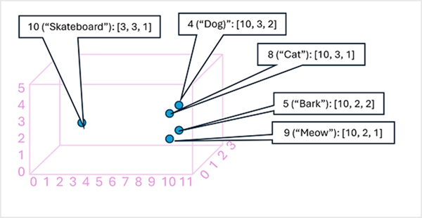
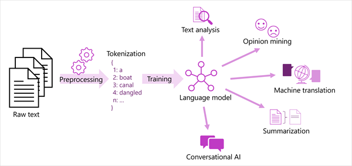

# Text Analysis with the Language Service

## Intro
In order for computer systems to interpret the subject of a text in a similar way humans do, they use `natural language processing (NLP)`.

`NLP` is an area within AI that deals with understanding written or spoken language, and responding in kind.

`Text analysis` describes NLP processes that extract information from unstructured text.

NLP uses:
- Detect sentiment for a product marketing campaign
- Summarize documents in a catalog
- Extract brands and company names from text

Resource: **Azure AI Language**

## Understand Text Analytics

Early techniques used to analyze text with computers involved statistical analysis of a body of text (a corpus) to infer some kind of semantic meaning. 

> If you can determine the most commonly used words in a given document, you can often get a good idea of what the document is about.

### Tokenization
The first step in analyzing a corpus is to break it down into tokens. 

Common tokenization concepts that may apply to a specific kind of NLP problem:

- **Text normalization**: Normalize the text by removing punctuation and changing all words to lower case. 
- **Stop word removal**: Stop words are words that should be excluded from the analysis. For example, "the", "a", or "it" make text easier for people to read but add little semantic meaning. 
- **n-grams**: Multi-term phrases such as "I have" or "he walked". A single word phrase is a unigram, a two-word phrase is a bi-gram, a three-word phrase is a tri-gram, and so on. By considering words as groups, a machine learning model can make better sense of the text.
- **Stemming**: Technique in which algorithms are applied to consolidate words before counting them, so that words with the same root are interpreted as being the same token.
- **Vectorization**: Captures semantic relationships between words by assigning them to locations in n-dimensional space.

### Frequency analysis
Count the number of occurrences of each token, and determine the main subject of a test corpus by finding the most frequently used tokens/bigrams.

Degree of relevance is better analyzed with **Term frequency - inverse document frequency (TF-IDF)**, a common technique in which a score is calculated based on how often a word or term appears in one document compared to its more general frequency across the entire collection of documents.

### Machine learning for text classification
**Classification algorithms**, such as `logistic regression`, are used to train a machine learning model that classifies text based on a known set of categorizations. 

This technique can be used to train a model that classifies text as positive or negative in order to perform sentiment analysis or opinion mining.

### Semantic language models
The ability to train `models that encapsulate the semantic relationship between tokens` has led to the emergence of powerful language models. At the heart of these models is the `encoding of language tokens as vectors` (multi-valued arrays of numbers) known as `embeddings`.

Thinking of elements in a token embedding vector as coordinates in multidimensional space, then each token occupies a specific "location." The closer tokens are to one another along a particular dimension, the more semantically related they are.

**The Embedding Space**

### Modern language processing solutions
- Models used in industry are based on these principles but have greater complexity (e.g., many more dimensions). 
- There are also multiple ways you can calculate appropriate embeddings for a given set of tokens. 
- Different methods result in different predictions from natural language processing models.

Common NLP tasks supported by language models:
- Text analysis
- Sentiment analysis and opinion mining 
- Machine translation (one language to another)
- Summarization
- Conversational AI

### Get started with text analysis
**Azure AI Language** can perform advanced NLP over unstructured text. 

Features include:
- Named entity recognition - people, places, events
    - Return list of entities with a type (e.g., Person/Location), sub-type (e.g., for type=Quantity, sub-types of Number/Percentage)
- Entity linking
    - Disambiguate entities by linking to a specific reference (e.g., Wikipedia)
- PII/PHI detection
- Language detection 
    - Language name, ISO 6391 Code, and confidence score
- Sentiment analysis and opinion mining
    - Labels (positive/neutral/negative)
    - Sentiment scores for each label (0-1)
- Summarization 
- Key phrase extraction
    - Main points from text

