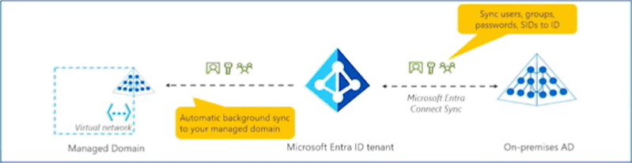
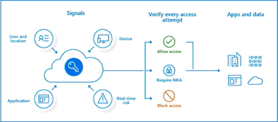

# Authentication and Authorization

## Microsoft Entra ID
**Microsoft Entra ID** is Microsoft Azure's cloud-based identity and access management service.
- Authentication (employees sign-in to access resources).
- Single sign-on (SSO).
- Application management.
- Business to Business (B2B).
- Device management.

> You manage the credentials, but Microsoft ensures the global availability of the process.

Microsoft also detects suspicious login attempts due to:
- Unknown devices
- Suspicious locations

## Microsoft Entra Domain Services

- Gain the benefit of cloud-based domain services without managing domain controllers
- Run legacy applications (that can't use modern auth standards) in the cloud
- Automatically sync from Microsoft Entra ID

### Compare Authentication and Authorization
Authentication
- Identifies the person or service seeking access to a resource.
- Requests legitimate access credentials.
- Basis for creating secure identity and access control principles.

Authorization
- Determines an authenticated person's or service's level of access.
- Defines which data they can access, and what they can do with it.

## Microsoft Entra External ID B2B

### Conditional Access
Organizations now use identity-driven signals as part of their access control decisions. Microsoft Entra Conditional Access brings signals together, to make decisions, and enforce organizational policies. Conditional Access is Microsoft's Zero Trust policy engine taking signals from various sources into account when enforcing policy decisions.

**Conditional Access** is used to bring signals together, to make decisions, and enforce organizational policies.
- User or Group Membership
- IP Location
- Device
- Application
- Risk Detection

## Role-based access control
- Fine-grained access management.
- Segregate duties within the team and grant only the amount of access to users that they need to perform their jobs.
- Enables access to the Azure portal and controlling access to resources.