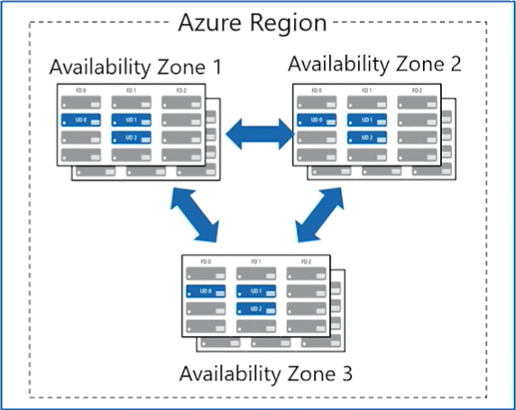
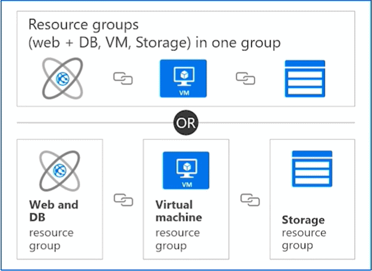
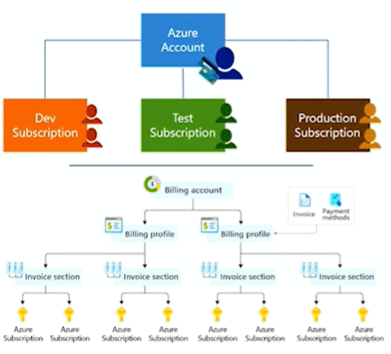
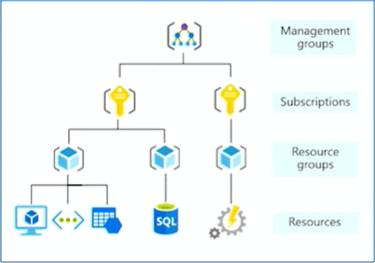

# Azure Architecture

## Regions
Azure offers more global regions than any other cloud provider with 60+ regions representing over 140 countries

- Regions are made up of one or more datacenters in close proximity.
- Provide flexibility and scale to reduce customer latency.
- Preserve data residency with a comprehensive compliance offering.

## Availability zones
Azure Availability Zones are unique physical locations within an Azure region and offer high availability to protect your applications and data from datacenter failures.

- Provide protection against downtime due to datacenter failure
- Physically separate datacenters within the same region
- Each datacenter is equipped with independent power, cooling, and networking
- Connected through private fiber-optic networks

The following diagram show three availability zones in a single Azure Region:

## Region Pairs
Many regions also have a paired region to support cross-region replication based on proximity and other factors.

- At least 300 miles of separation between region pairs.
- Automatic replication for some services.
- Prioritized region recovery in the event of outage.
- Updates are rollout sequentially to minimize downtime.

### Paired Regions
| Region | Paired Region |
|--|--|
| North Central US | South Central US |
| East US | West US |
| West US 2 | West Central US |
| US East 2 | Central US |
| Canada Central | Canada East |
| North Europe | West Europe |
| UK West | UK South |
| Germany Central | Germany Northeast |
| South East Asia | East Asia |
| East China | North China |
| Japan East | Japan West |
| Australia Southeast | Australia East |
| India South | India Central |
| Brazil South (Primary) | South Central US |

> Learn more about paired regions: https://aka.ms/PairedRegions

> Cross-region replication: https://learn.microsoft.com/en-us/azure/reliability/cross-region-replication-azure

## Azure Sovereign Regions (US Government services)
Meets the security and compliance needs of US federal agencies, state and local governments, and their solution providers.

Azure Government features:
- Separate instance of Azure
- Physically isolated from non-US government deployments
- Accessible only to screened, authorized personnel

## Azure Sovereign Regions (Azure China)
Microsoft is China's first foreign public cloud service provider, in compliance with government regulations.

Azure China features:
- Physically separated instance of Azure cloud services operated by 21Vianet
- All data stays within China to ensure compliance

## Microsoft Datacenters
Azure datacenters are unique physical buildings—located all over the globe—that house a group of networked computer servers.

> Learn more: https://datacenters.microsoft.com/globe/explore

## Resources

### Azure Resources
Azure resources are components like storage, virtual machines, and networks that are available to build cloud solutions.

Examples of resources:
- Virtual Machines
- Storage Accounts
- Virtual Networks
- SQL
- App Services
- SQL Databases
- Functions

## Resource groups
A resource group is a container to manage and aggregate resources in a single unit.

- Resources can exist in only one resource group.
- Resources can exist in different regions.
- Resources can be moved to different resource groups.
- Applications can utilize multiple resource groups.

## Azure Subscriptions
An Azure subscription provides you with authenticated and authorized access to Azure accounts.

- **Billing boundary:** generate separate billing reports and invoices for each subscription.
- **Access control boundary:** manage and control access to the resources that users can provision with specific subscriptions.

## Management Groups
Management groups provide a governance scope above subscriptions. You organize subscriptions into management groups; the governance conditions you apply cascade by inheritance to all associated subscriptions.

- Management groups can include multiple Azure subscriptions
- Subscriptions inherit conditions applied to the management group
- 10,000 management groups can be supported in a single directory
- A management group tree can support up to six levels of depth

