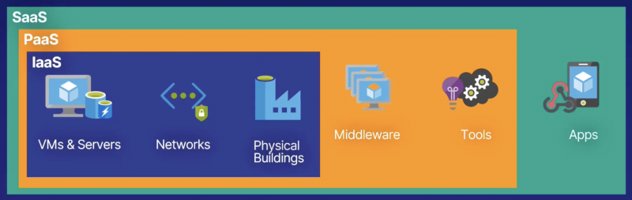
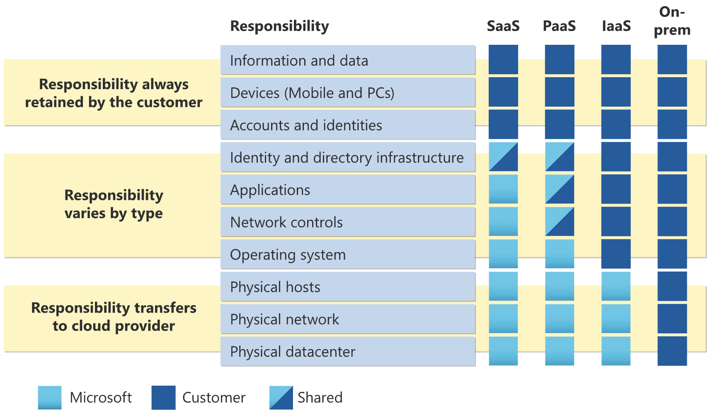

# Cloud Concepts
Concepts of cloud computing can be quite different from those of traditional computing, which often includes owning servers, buildings, cables, and employing people to manage everything.

## The Language of Cloud Computing
Cloud computing has terms that are specific and 
critical to understanding it. 

- **High availability** means systems are always available - even automatically! 
- **Reliability** describes how Azure can tolerate failures or even disasters. 
- **Scalability** refers to scaling out or scaling up while automatically providing resources as needed. 
- **Predictability** is knowing your application will always perform as expected and knowing what it will cost. 
- **Security** is having full control of your cloud security posture. 
- **Governance** is standardizing cloud deployments to meet requirements/company standards 
- **Manageability** is management of cloud resources and how we interact with them. 

### High Availability
High availability is core to the cloud. 
- Traditional 
    - You own the hardware. 
    - You have physical access. 
    - You can't "just add servers." 
- Cloud 
    - You don't own the hardware. 
    - Add more servers with a click. 
    - If hardware fails, replace it instantly.

### Reliability 
(a.k.a. Fault Tolerance or Disaster Recovery) 
- **Resilience** \
The ability of a system to recover from failures 
and continue to function 
- **Deploy in Multiple Locations**
    - Global-scale computing 
    - Protects against regional failure/disaster 
- **No Single Point of Failure**
    - Resources in multiple locations 
    - If one computer goes down, others pick up the load 

### Scalability and Elasticity
- **Scalability** - The ability to scale Vertically (up or down), and horizontally (in or out)
    - Automatically adjust resources to meet demand. 
        - Example: Increase the number of VMS to handle peak traffic. 
    - Scaling in the Cloud
        - Horizontal = Adding additional VMs/containers 
            - "Scaling out" 
        - Vertical = Increasing power (e.g., CPU/RAM) of existing VMS 
            - "Scaling up" 
- **Elasticity** - The ability to scale automatically
    - Don't overpay for services. 
    - Automatically reduce resources when demand drops. 
> 'Typical' cloud model = Horizontal scaling 

### Predictability 
Predictable Performance and Costs 
- **Performance**
    - Consistent experience for customers regardless of traffic. 
    - Autoscaling, load balancing, and high availability provide a consistent experience. 
- **Costs**
    - No unexpected surprises. 
    - Track and forecast resource usage (costs) in real time. 
    - Analytics provide patterns/trends to optimize usage. 

### Security 
Full control of the security of your cloud 
environment. Patches, maintenance, 
network control, and more! 

### Governance 
- Standardized environments 
Regulatory requirements 
- Audit for compliance 

### Manageability 
Management of the cloud: 
- Autoscaling 
- Monitoring 
- Template-based deployments

Management in the cloud: 
- Azure portal 
- CLI 
- APIs 

## Language of Cloud Economics

| Capital Expenditure (CapEx)         | Operational Expenditure (OpEx) |
| ------------- |-----------|
| - The up-front spending of money on physical infrastructure | - Spend on products and services as needed, pay- as-you-go |
| - Costs from CapEx have a value that reduces over time | - Get billed immediately |
|  |  |

## Cloud Service Models

### Infrastructure as a Service (laaS)
Build pay-as-you-go IT infrastructure by renting servers, virtual machines, storage, networks, and operating systems from a cloud provider.
**laaS** consists of:
- Servers and storage
- Networking, firewalls/Security
- Datacenter, physical plant/building

### Platform as a Service (PaaS)
Provides environment for building, testing, and deploying software applications; without focusing on managing underlying infrastructure.
**PaaS** consists of:
- laaS
    - Servers and storage
    - Networking, firewalls/Security
    - Datacenter, physical plant/building
- Operating systems
- Development Tools, database Management, business analytics

### Software as a Service (Saas)
Users connect to and use cloud-based apps over the internet: for example, Microsoft Office 365, email, and calendars.
- PaaS
    - laaS
        - Servers and storage
        - Networking, firewalls/Security
        - Datacenter, physical plant/building
    - Operating systems
    - Development Tools, database Management, business analytics
- Hosted applications/apps

## Identifying Cloud Service Models
| Model | 
Characteristics
 | Examples |
|:--:|:--|:--:|
| IaaS | <ul><li>Organization has complete control of the infrastructure.</li><li>Dynamic and flexible. You can do almost anything.</li><li>Cost varies depending on consumption.</li><li>Services are highly scalable.</li><li>Multiple users share a single piece of hardware. </li></ul> | VM, VNet, Storage |
| PaaS | <ul><li>Resources are virtualized and can easily be scaled up or down as needed.</li><li>Services often assist with the development, testing and deployment of apps.</li><li>Multi-user access via the same development application.</li><li>Integrates web services and databases.</li></ul> | App Service, CDN, CosmosDB |
| SaaS | <ul><li>Managed from a central location.</li><li>Hosted on a remote server.</li><li>Accessible over the internet.</li><li>Users not responsible for hardware or software updates.</li><li>Rate limiting/QoS.</li></ul> | Microsoft 365 |

### Cloud service comparison
| 
laas
 | 
Paas
 | 
SaaS
 |
|----|----|----|
| The most flexible cloud service | Focus on application development | Pay-as-you-go pricing model |
| You configure and manage the hardware for your application | Platform management is handled by the cloud provider | Users pay for the software they use on a subscription model |

## Shared Responsibility Model

| Responsibility | Saas | PaaS | laaS | On-Prem |
|--|--|--|--|--|
| **Responsibility always Retained by the customer**
| Information and data | Customer | Customer | Customer | Customer |
| Devices (Mobile and PCs) | Customer | Customer | Customer | Customer |
| Accounts and identities | Customer | Customer | Customer | Customer |
| **Responsibility varies by type**
| Identity and directory infrastructure | Shared | Shared | Customer | Customer |
| Applications | Microsoft | Shared | Customer | Customer |
| Network controls | Microsoft | Shared | Customer | Customer |
| Operating system | Microsoft | Microsoft | Customer | Customer |
| **Responsibility transfers to cloud provider**
| Physical hosts | Microsoft | Microsoft | Customer | Customer |
| Physical network | Microsoft | Microsoft | Customer | Customer |
| Physical datacenter | Microsoft | Microsoft | Customer | Customer |

## Cloud Architecture Models
> Choose your cloud architecture model wisely. 

### Private Cloud
**Private cloud** is Azure on your own hardware in a location of your choice. 
All the benefits of public cloud, but you can lock it down. A lot of staff required. 
- Organizations create a cloud environment in their datacenter.
- Organization is responsible for operating the services they provide.
- Does not provide access to users outside of the organization.

Decision points:
- Pros 
    - Complete control of infrastructure 
    - Benefits of public cloud 
    - Better security and privacy 
- Cons 
    - Maintenance 
    - Staffing 

### Public Cloud 
**Public cloud** is Azure, AWS, GCP. No upfront costs, but monthly usage. 
Little control over services and infrastructure. 

Decision points:
- Pros 
    - No purchase of hardware 
    - Low monthly fees 
- Cons 
    - No control over features and versions 
    - No physical access

### Hybrid Cloud
**Hybrid cloud** model is the best of private and public, but could be complex. 

Decision points:
- Pros 
    - Avoid disruptions and outages 
    - Adhere to regulation, governance etc. 
    - Span both public and private cloud 
    - Alleviate CapEx investments 
- Cons 
    - Complex infrastructure

### Cloud model comparison
<table>
    <tr style="border-bottom: 1px solid #333;">
        <td>
            
Public Cloud

        </td>
        <td>
            <ul>
                <li>No capital expenditures to scale up</li>
                <li>Applications can be quickly provisioned and deprovisioned</li>
                <li>Organizations pay only for what they use</li>
            </ul>
        </td>
    </tr>
    <tr style="border-bottom: 1px solid #333;">
        <td>
            
Private Cloud

        </td>
        <td>
            <ul>
                <li>Hardware must be purchased for start-up and maintenance</li>
                <li>Organizations have complete control over resources and security</li>
                <li>Organizations are responsible for hardware maintenance and updates</li>
            </ul>
        </td>
    </tr>
    <tr>
        <td>
            
Hybrid Cloud

        </td>
        <td>
            <ul>
                <li>Provides the most flexibility</li>
                <li>Organizations determine where to run their applications</li>
                <li>Organizations control security, compliance, or legal requirements</li>
            </ul>
        </td>
    </tr>
</table>

