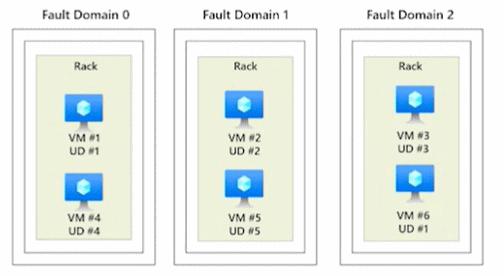

# Compute
**Compute** is a term that covers any service in Azure that enables a computation in the cloud.

## Compute Summary 
- **Virtual Machines**
    - Virtualized hardware you control. 
    - Spin up and down as needed. 
    - Take advantage of the Azure tools available. 
    - Priced per hour with many configurations available. 
- **Scale Sets**
    - Sets of identical VMS. 
    - Scale sets automatically create and delete 
    - VMS for your application. 
    - Provides high availability and protects against server failures. 
- **App Services**
    - Managed platform to host your applications. 
    - Web app, containers and API. 
    - Supports a lot of programming languages.
- **Functions**
    - Serverless Azure offering.
    - A function does one compute action each time it is invoked.
- **Azure Kubernetes Service**
    - Open-source tool for orchestrating and managing many container images and applications. 
    - Uses clusters and pods to scale and deploy applications. 
- **Azure Container Instances**
    - Hosts and runs your containers on Azure. 
    - Containers have less overhead than virtual machines and can be deployed consistently. 
- **Windows Virtual Desktop**
    - 100% virtualized Windows 10. 
    - Access with any device that has a browser and internet  - connection. 
    - Reuse licenses to save some bananas. 

## Azure compute services
Azure **compute** is an on-demand computing service that provides computing resources such as disks, processors, memory, networking, and operating systems.

Examples of compute resources are:
- Virtual Machines (VM)
- VM Scale Sets
- App Services
- Container Instances
- Azure Kubernetes Services (AKS)
- Azure Virtual Desktop

## VM availability sets
Availability sets are logical groupings of VMs that reduce the chance of correlated failures bringing down related VMs at the same time. Availability sets place VMs in different fault domains for better reliability, especially beneficial if a region doesn't support availability zones. When using availability sets, create two or more VMs within an availability set. Using two or more VMs in an availability set helps highly available applications and meets the 99.95% Azure SLA. There's no extra cost for using availability sets, you only pay for each VM instance you create.

Availability sets do this by grouping VMs in two ways: update domain and fault domain.

- **Update domain** \
The update domain groups VMs that can be rebooted at the same time. This allows you to apply updates while knowing that only one update domain grouping will be offline at a time. All of the machines in one update domain will be updated. An update group going through the update process is given a 30-minute time to recover before maintenance on the next update domain starts.
- **Fault domain** \
The fault domain groups your VMs by common power source and network switch. By default, an availability set will split your VMs across up to three fault domains. This helps protect against a physical power or networking failure by having VMs in different fault domains (thus being connected to different power and networking resources).

## Azure Virtual Desktop
**Azure Virtual Desktop** is a desktop and app virtualization that runs in the cloud.
1. Create a full desktop virtualization environment without having to run additional gateway servers.
1. Reduce risk of resource being left behind.
1. True multi-session deployments.

## What are containers?
Containers are a virtualization environment. Much like running multiple virtual machines on a single physical host, you can run multiple containers on a single physical or virtual host. Unlike virtual machines, you don't manage the operating system for a container. 

Containers are often used to create solutions by using a microservice architecture. This architecture is where you break solutions into smaller, independent pieces. 

This split allows you to separate portions of your app into logical sections that can be maintained, scaled, or updated independently.

## Azure Container Services
**Azure Containers** are a light-weight, virtualized environment that does not require operating system management, and can respond to changes on demand.

- **Azure Container Instances:** a PaaS offering that runs a container or pod of containers in Azure.
- **Azure Container Apps:** a PaaS offering like container instances that can load balance and scale.
- **Azure Kubernetes Service:** an orchestration service for containers with distributed architectures and large volumes of containers.

## Comparing Azure compute options
| 
Virtual Machines
 | 
Virtual Desktop
 | 
Containers
 |
|----|----|----|
| Cloud based server that supports either Windows or Linux environments. | Provides a cloud based personal computer Windows desktop experience. | Lightweight, miniature environment well suited for running microservices. |
| Useful for lift-and-shift migrations to the cloud. | Dedicated applications to connect and use, or accessible from any modern browser. | Designed for scalability and resiliency through orchestration. |
| Complete operating system package, including the host operating system. | Multi-client login allows multiple users to log into the same machine at the same time. | Applications and services are packaged in a container that sits on- top of the host operating system. Multiple containers can sit on one host OS. |

## Azure App Services
Azure **App Services** is a fully managed platform to build, deploy, and scale web apps and APIs quickly.
- Works with .NET, .NET Core, Node.js, Java, Python, or php.
- PaaS offering with enterprise-grade performance, security, and compliance requirements.