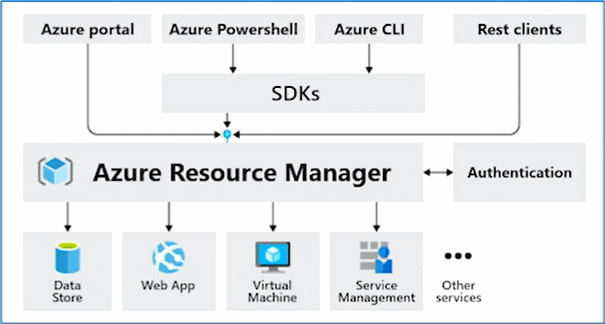
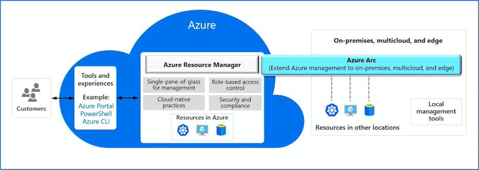

# Monitoring and Management

## Microsoft Purview
Microsoft Purview is a family of data governance, risk, and compliance solutions that helps you get a single, unified view into your data- Microsoft Purview brings insights about your on-premises, multi-cloud, and software-as-a-service data together.
- Automated data discovery
- Sensitive data classification
- End-to-end data lineage

## Azure Policy
**Azure Policy** is a service in Azure that enables you to create, assign, and manage policies that control or audit your resources. These policies enforce different rules across your resource configurations so that those configurations stay compliant with corporate standards.

Azure Policy helps to enforce organizational standards and to assess compliance at-scale- Provides governance and resource consistency with regulatory compliance, security, cost, and management.
- Evaluates and identifies Azure resources that do not comply with your policies.
- Provides built-in policy and initiative definitions, under categories such as Storage, Networking, Compute, Security Center, and Monitoring.

## Resource locks
- Protect your Azure resources from accidental deletion or modification.
- Manage locks at subscription, resource group, or individual resource levels within Azure Portal.

| Lock Type | Read Permission | Update Permission | Delete Permission |
|--|--|--|--|
| CanNotDelete | Yes | Yes | No |
| ReadOnly | Yes | No | No |

### Lock inheritance
When you apply a lock at a parent scope, all resources within that scope inherit the same lock. Even resources you add later inherit the same parent lock. The most restrictive lock in the inheritance takes precedence.

## Service Trust portal
The Microsoft Service Trust Portal (STP) is a one-stop shop for security, regulatory compliance, and privacy information related to the Microsoft cloud.
> Built upon a foundation of trust, security and compliance

## Tools for interacting with Azure
- Azure Portal
- Azure PowerShell
- Azure Cloud Shell
- Command-Line Interface (CLI)

## Azure Resource Manager
The Azure Resource Manager (ARM) provides a management layer that enables you to create, update, and delete resources in your Azure subscription.



## Infrastructure as code
- Ensure consistency in deployment across your cloud ecosystem.
- Manage configuration at scale.
- Rapidly provision additional environments based on a standard configuration and build.

## Azure Resource Manager (ARM) templates
Azure Resource Manager (ARM) templates are *JavaScript Object Notation (JSON)* files that can be used to create and deploy Azure infrastructure without having to write programming commands.

- Declarative syntax
- Repeatable results
- Orchestration
- Modular files
- Built-in validation
- Exportable code

ARM Templates can be written with:
- Bicep
    ```js
    param location string = resourceGroup().location
    param storageAccountName string = 'toylaunch${uniqueString(resourceGroup().id)}'
    resource storageAccount 'Microsoft- Storage/storageAccounts@2021-06-01' = {
        name: storageAccountName
        location: location
        sku: {
            name: 'Standard_LRS'
        }
         kind: 'StorageV2'
         properties: { 
            accessTier: 'Hot'
        }
    }
- JSON
    ```json
    {
        "$schema": "https://schema.management.azure.com/schemas/2019-04-01/deploymentTemplate.json#", 
        "contentVersion": "1.0.0.0",
        "parameters": { 
            "location": { 
                "type": "string", 
                "defaultValue": "[resourceGroup() - location]"
            },
            "storageAccountName": { 
                "type": "string", 
                "defaultValue": "[format('toylaunch{0}', uniqueString(resourceGroup().id))]"
            }
        },
        "resources": [
            {
                "type": "Microsoft- Storage/storageAccounts","apiVersion": "2021-06-01",
                "name": "[parameters ('storageAccountName' )]",
                "location": "[parameters('location')]",
                "sku": {
                    "name": "Standard_LRS"
                },
                "kind": "StorageV2",
                "properties": {
                    "accessTier": "Hot"
                }
            }
        ]
    }
    ```

## Azure Arc
Azure Arc is a bridge that extends the Azure platform to help you build applications and services with the flexibility to run across datacenters, at the edge, and in multicloud environments. 

> Use Azure Arc solutions for hybrid and multi-cloud management to run Azure services anywhere.

## Azure Advisor
**Azure Advisor** analyzes deployed Azure resources and makes recommendations based on best practices to optimize Azure deployments.
- Reliability
- Security
- Performance
- Cost
- Operational Excellence

## Azure Service Health
**Azure Service Health** is a collection of services that keep you informed of general Azure status, service status that may impact you, and specific resource status that is impacting you.

- **Azure Status:** global view of the health of all Azure services across all Azure regions
- **Service Health:** focused view on only the services and regions that you're using- If a service is experiencing a problem in a region you're not using, it won't show up here
- **Resource Health:** tailored view of your actual Azure resources- It provides information about the health of your individual cloud resources

## Azure Monitor
**Azure Monitor** is a platform for collecting data on your resources, analyzing that data, visualizing the information, and even acting on the results. Azure Monitor can monitor Azure resources, your on-premises resources, and even multi-cloud resources like virtual machines hosted with a different cloud provider.