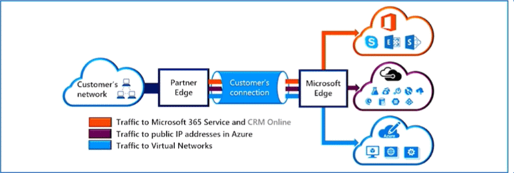

# Networking

## Azure networking services
**Azure Virtual Network (VNet)** enables Azure resources to communicate with each other, the internet, and on-premises networks.

- Public endpoints, accessible from anywhere on the internet
- Private endpoints, accessible only from within your network
- Virtual subnets, segment your network to suit your needs
- Network peering, connect your private networks directly together

### Address Space
An **address space** is the range of IP addresses that are available. Every service or resource that is connected to a VNet will get its own unique address on that VNet within the address space. That is how services on the same VNet can find each other and communicate.

You assign an address space to the VNet, and each connected device, service, or resource automatically gets an IP address assigned in that address space.

**Subnets** enable you to segment the virtual network into one or more subnetworks and allocate a portion of the virtual network's address space to each subnet.

## Virtual Networks
A **virtual network (VNet)** is a fundamental part of the Azure infrastructure. Each VNet belongs to a single region and a single subscription.

The cloud advantages of virtual networks are:
- **Scaling** \
Adding more VNets or more addresses to a VNet is simple.
- **High Availability** \
Peering VNets, using a load balancer, or using a VPN gateway all increase availability.
- **Isolation** \
Manage and organize resources with subnets and network security groups.

### Virtual Network Peering
Allows you to connect two or more VNets together. Traffic uses the private Microsoft backbone network and never passes through the public Internet. Just like as if the resources are on the same VNet.

Benefits:
- **Low latency, high bandwith** \
Resources in virtual networks are connected with a low-latency, high-bandwith connection.
- **Link separate networks** \
Resources in separate virtual networks can communicate with each other.
- **Data transfer** \
Transfer data easily between subscriptions and deployment models in separate regions.

## Load Balancers
A **load balancer** distributes new inbound flows that arrive on the load balancer's frontend to backend pool instances, according to rules and health probes.
- Inbound flows - traffic from the Internet or local network.
- Frontend - access point for the load balancer. All traffic goes here first.
- Backend pool - the VM instances receiving the traffic.
- Rules & health probes - checks to ensure the backend instance can received the data.

### Load balancer scenarios
- **Internet traffic** \
Balance the load of incoming Internet traffic into a system or application.
- **Internal networks** \
A load balancer works well with internal applications.
- **Port forwarding** \
Traffic can be forwarded to a specific machine in the backend pool.
- **Outbound traffic** \
Allow outbound connectivity for backend pool VMs.

## Application Gateways
An **application gateway** is a higher level load balancer. It works on the HTTP request, so it allows for routing of traffic based on things other than IP address and port number. Traffic from a specific web address (e.g., /images/) can be routed to a specific backend machine.

Benefits:
1. **Scaling** \
Scale the application gateway up or down based on the amount of traffic received.
1. **End-to-end encryption** \
Comply with any security policies. Disable or enable traffic encryption to the backend.
1. **Zone redundancy** \
Span multiple availability zones and improve fault resiliency.
1. **ZMulti-site hosting** \
Use the same application gateway for up to 100 websites.

## Content Delivery Network (CDN)
TODO

## VPN Gateways
TODO

**Virtual Private Network Gateway (VPN)** is used to send encrypted traffic between an Azure virtual network and an on-premises location over the public internet.

")

## Azure ExpressRoute
**Azure ExpressRoute** extends on-premises networks into Azure over a private connection that is facilitated by a connectivity provider.

## Azure DNS
- **Reliability and performance** by leveraging a global network of DNS name servers using Anycast networking
- **Azure DNS security** is based on Azure resource manager, enabling role-based access control and monitoring and logging
- **Ease of use** for managing your Azure and external resources with a single DNS service
- **Customizable virtual networks** allow you to use private, fully customized domain names in your private virtual networks
- **Alias records** supports alias record sets to point directly to an Azure resource.