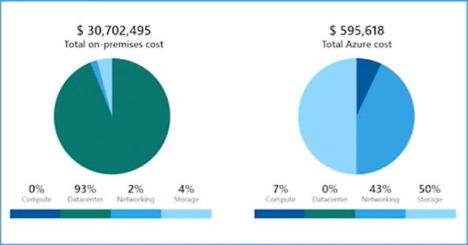

# Pricing and Cost Management

## Factors affecting costs
These are some of the factors affecting costs:
1. **Resource Type** \
Costs are resource-specific, so the usage that a meter tracks and the number of meters associated with a resource, depend on the
resource type.

1. **Consumption** \
With a pay-as-you-go model, consumption is one of the biggest drivers of costs.

1. **Maintenance** \
Monitoring your Azure footprint and maintaining your environment can help you identify and mitigate costs that aren't necessary, such as shutting down under used virtual machines.

1. **Geography** \
The same resource type can cost different amounts depending on the geographic area, so geography has an impact on Azure costs.

1. **Network traffic** \
While some inbound data transfers are free, the cost for outbound data or data between Azure resources is impacted by Billing zones.

1. **Subscription** \
The type and configuration of your subscription can also impact your cost- For example, the free trial lets you explore some Azure resources for free.

## Pricing Calculator
The Pricing Calculator is a tool that helps you estimate the cost of Azure products- The options that you can configure in the Pricing Calculator vary between products, but basic configuration options include:
- Region
- Tier
- Virtual Machines O .
- Billing options
- Support options
- Programs and offers
- Azure dev/test pricing

## Total Cost of Ownership Calculator
- A tool to estimate cost savings you can realize by migrating to Azure.
- A report compares the costs of on-premises infrastructures with the costs of using Azure products and services in the cloud.

## Microsoft Cost Management
- Reporting - billing reports
- Data enrichment
- Budgets - set spend budget
- Alerting - when cost exceed limits
- Recommendation - cost recommendations