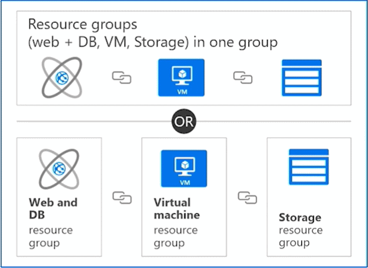
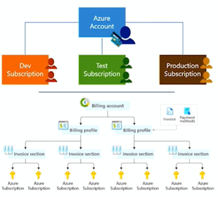
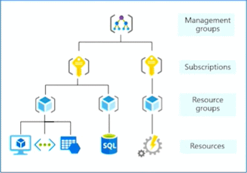
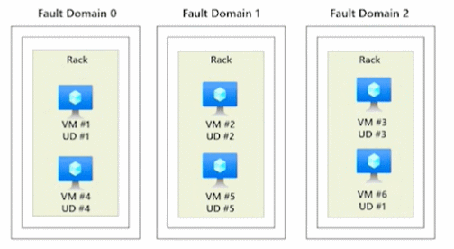
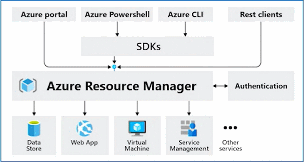
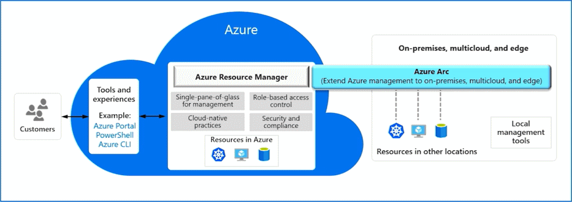

# AZ-900 Virtual Training Day
Tuesday, February 20, 2024 12:10 PM

## Private cloud
- Organizations create a cloud environment in their datacenter.
- Organization is responsible for operating the services they provide.
- Does not provide access to users outside of the organization.

## Public cloud
- Owned by cloud services or hosting provider.
- Provides resources and services to multiple organizations and users.
- Accessed via secure network connection (typically over the internet).

## Hybrid cloud
Combines Public and Private clouds to allow applications to run in the most appropriate location.

# Cloud model comparison
<table>
    <tr style="border-bottom: 1px solid #333;">
        <td>
            <div style="padding: 10px; background-color: #469;">Public Cloud</div>
        </td>
        <td>
            <ul>
                <li>No capital expenditures to scale up</li>
                <li>Applications can be quickly provisioned and deprovisioned</li>
                <li>Organizations pay only for what they use</li>
            </ul>
        </td>
    </tr>
    <tr style="border-bottom: 1px solid #333;">
        <td>
            <div style="padding: 10px; background-color: #469;">Private Cloud</div>
        </td>
        <td>
            <ul>
                <li>Hardware must be purchased for start-up and maintenance</li>
                <li>Organizations have complete control over resources and security</li>
                <li>Organizations are responsible for hardware maintenance and updates</li>
            </ul>
        </td>
    </tr>
    <tr>
        <td>
            <div style="padding: 10px; background-color: #469;">Hybrid Cloud</div>
        </td>
        <td>
            <ul>
                <li>Provides the most flexibility</li>
                <li>Organizations determine where to run their applications</li>
                <li>Organizations control security, compliance, or legal requirements</li>
            </ul>
        </td>
    </tr>
</table>

## Compare CapEx vs OpEx
| Capital Expenditure (CapEx)         | Operational Expenditure (OpEx) |
| ------------- |-----------|
| - The up-front spending of money on physical infrastructure | - Spend on products and services as needed, pay- as-you-go |
| - Costs from CapEx have a value that reduces over time | - Get billed immediately |
|  |  |

## Scalability and Elasticity
- **Scalability** - The ability to scale Vertically (up or down), and horizontally (in or out)
- **Elasticity** - The ability to scale automatically


## Cloud Benefits
<table>
    <tr>
        <td>
            <div style="padding: 10px; background-color: #0171E9; width: 150px; text-align: center;">High Availability</div>
        </td>
        <td>
            <div style="padding: 10px; background-color: #0171E9; width: 150px; text-align: center;">Reliability</div>
        </td>
    </tr>
    <tr>
        <td>
            <div style="padding: 10px; background-color: #1058C2; width: 150px; text-align: center;">Scalability</div>
        </td>
        <td>
            <div style="padding: 10px; background-color: #1058C2; width: 150px; text-align: center;">Elasticity</div>
        </td>
    </tr>
    <tr>
        <td>
            <div style="padding: 10px; background-color: #423E9A; width: 150px; text-align: center;">Predictability</div>
        </td>
        <td>
            <div style="padding: 10px; background-color: #423E9A; width: 150px; text-align: center;">Security</div>
        </td>
    </tr>
    <tr>
        <td>
            <div style="padding: 10px; background-color: #742373; width: 150px; text-align: center;">Governance</div>
        </td>
        <td>
            <div style="padding: 10px; background-color: #742373; width: 150px; text-align: center;">Manageability</div>
        </td>
    </tr>
</table>

## Infrastructure as a Service (laaS)
Build pay-as-you-go IT infrastructure by renting servers, virtual machines, storage, networks, and operating systems from a cloud provider.
**laaS** consists of:
- Servers and storage
- Networking, firewalls/Security
- Datacenter, physical plant/building
## Platform as a Service (PaaS)
Provides environment for building, testing, and deploying software applications; without focusing on managing underlying infrastructure.
**PaaS** consists of:
- laaS
    - Servers and storage
    - Networking, firewalls/Security
    - Datacenter, physical plant/building
- Operating systems
- Development Tools, database Management, business analytics
## Software as a Service (Saas)
Users connect to and use cloud-based apps over the internet: for example, Microsoft Office 365, email, and calendars.
- PaaS
    - laaS
        - Servers and storage
        - Networking, firewalls/Security
        - Datacenter, physical plant/building
    - Operating systems
    - Development Tools, database Management, business analytics
- Hosted applications/apps

## Cloud service comparison
| <div style="padding: 10px; background-color: #001021; width: 90%; text-align: center;">laas</div> | <div style="padding: 10px; background-color: #0171E9; width: 90%; text-align: center;">Paas</div> | <div style="padding: 10px; background-color: #742373; width: 90%; text-align: center;">SaaS</div> |
|----|----|----|
| The most flexible cloud service | Focus on application development | Pay-as-you-go pricing model |
| You configure and manage the hardware for your application | Platform management is handled by the cloud provider | Users pay for the software they use on a subscription model |

## Shared Responsibility Model


| Responsibility | Saas | PaaS | laaS | On-Prem |
|--|--|--|--|--|
| **Responsibility always Retained by the customer**
| Information and data | Customer | Customer | Customer | Customer |
| Devices (Mobile and PCs) | Customer | Customer | Customer | Customer |
| Accounts and identities | Customer | Customer | Customer | Customer |
| **Responsibility varies by type**
| Identity and directory infrastructure | Shared | Shared | Customer | Customer |
| Applications | Microsoft | Shared | Customer | Customer |
| Network controls | Microsoft | Shared | Customer | Customer |
| Operating system | Microsoft | Microsoft | Customer | Customer |
| **Responsibility transfers to cloud provider**
| Physical hosts | Microsoft | Microsoft | Customer | Customer |
| Physical network | Microsoft | Microsoft | Customer | Customer |
| Physical datacenter | Microsoft | Microsoft | Customer | Customer |

## Regions
Azure offers more global regions than any other cloud provider with 60+ regions representing over 140 countries

- Regions are made up of one or more datacenters in close proximity.
- Provide flexibility and scale to reduce customer latency.
- Preserve data residency with a comprehensive compliance offering.

## Availability zones
Azure Availability Zones are unique physical locations within an Azure region and offer high availability to protect your applications and data from datacenter failures.

- Provide protection against downtime due to datacenter failure
- Physically separate datacenters within the same region
- Each datacenter is equipped with independent power, cooling, and networking
- Connected through private fiber-optic networks

The following diagram show three availability zones in a single Azure Region:


## Region Pairs
Many regions also have a paired region to support cross-region replication based on proximity and other factors.

- At least 300 miles of separation between region pairs.
- Automatic replication for some services.
- Prioritized region recovery in the event of outage.
- Updates are rollout sequentially to minimize downtime.

### Paired Regions
| Region | Paired Region |
|--|--|
| North Central US | South Central US |
| East US | West US |
| West US 2 | West Central US |
| US East 2 | Central US |
| Canada Central | Canada East |
| North Europe | West Europe |
| UK West | UK South |
| Germany Central | Germany Northeast |
| South East Asia | East Asia |
| East China | North China |
| Japan East | Japan West |
| Australia Southeast | Australia East |
| India South | India Central |
| Brazil South (Primary) | South Central US |

Learn more about paired regions: https://aka.ms/PairedRegions

Cross-region replication: https://learn.microsoft.com/en-us/azure/reliability/cross-region-replication-azure

## Azure Sovereign Regions (US Government services)
Meets the security and compliance needs of US federal agencies, state and local governments, and their solution providers.

Azure Government features:
- Separate instance of Azure
- Physically isolated from non-US government deployments
- Accessible only to screened, authorized personnel

## Azure Sovereign Regions (Azure China)
Microsoft is China's first foreign public cloud service provider, in compliance with government regulations.

Azure China features:
- Physically separated instance of Azure cloud services operated by 21Vianet
- All data stays within China to ensure compliance

## Microsoft Datacenters
Azure datacenters are unique physical buildings—located all over the globe—that house a group of networked computer servers.

Learn more: https://datacenters.microsoft.com/globe/explore

# Resources

## Azure Resources
Azure resources are components like storage, virtual machines, and networks that are available to build cloud solutions.

Examples of resources:
- Virtual Machines
- Storage Accounts
- Virtual Networks
- SQL
- App Services
- SQL Databases
- Functions

## Resource groups
A resource group is a container to manage and aggregate resources in a single unit.

- Resources can exist in only one resource group.
- Resources can exist in different regions.
- Resources can be moved to different resource groups.
- Applications can utilize multiple resource groups.



## Azure Subscriptions
An Azure subscription provides you with authenticated and authorized access to Azure accounts.

- **Billing boundary:** generate separate billing reports and invoices for each subscription.
- **Access control boundary:** manage and control access to the resources that users can provision with specific subscriptions.



## Management Groups
Management groups provide a governance scope above subscriptions. You organize subscriptions into management groups; the governance conditions you apply cascade by inheritance to all associated subscriptions.

- Management groups can include multiple Azure subscriptions
- Subscriptions inherit conditions applied to the management group
- 10,000 management groups can be supported in a single directory
- A management group tree can support up to six levels of depth



## Azure compute services
Azure **compute** is an on-demand computing service that provides computing resources such as disks, processors, memory, networking, and operating systems.

Examples of compute resources are:
- Virtual Machines
- App Services
- Container Instances
- Azure Kubernetes Services (AKS)
- Azure Virtual Desktop

## VM availability sets
Availability sets are logical groupings of VMs that reduce the chance of correlated failures bringing down related VMs at the same time. Availability sets place VMs in different fault domains for better reliability, especially beneficial if a region doesn't support availability zones. When using availability sets, create two or more VMs within an availability set. Using two or more VMs in an availability set helps highly available applications and meets the 99.95% Azure SLA. There's no extra cost for using availability sets, you only pay for each VM instance you create.



## Azure Virtual Desktop
**Azure Virtual Desktop** is a desktop and app virtualization that runs in the cloud.
1. Create a full desktop virtualization environment without having to run additional gateway servers.
1. Reduce risk of resource being left behind.
1. True multi-session deployments.

## Azure Container Services
**Azure Containers** are a light-weight, virtualized environment that does not require operating system management, and can respond to changes on demand.

- **Azure Container Instances:** a PaaS offering that runs a container or pod of containers in Azure.
- **Azure Container Apps:** a PaaS offering like container instances that can load balance and scale.
- **Azure Kubernetes Service:** an orchestration service for containers with distributed architectures and large volumes of containers.

## Comparing Azure compute options
| <div style="padding: 10px; background-color: #0171E9; width: 90%; text-align: center;">Virtual Machines</div> | <div style="padding: 10px; background-color: #001021; width: 90%; text-align: center;">Virtual Desktop</div> | <div style="padding: 10px; background-color: #742373; width: 90%; text-align: center;">Containers</div> |
|----|----|----|
| Cloud based server that supports either Windows or Linux environments. | Provides a cloud based personal computer Windows desktop experience. | Lightweight, miniature environment well suited for running microservices. |
| Useful for lift-and-shift migrations to the cloud. | Dedicated applications to connect and use, or accessible from any modern browser. | Designed for scalability and resiliency through orchestration. |
| Complete operating system package, including the host operating system. | Multi-client login allows multiple users to log into the same machine at the same time. | Applications and services are packaged in a container that sits on- top of the host operating system. Multiple containers can sit on one host OS. |

## Azure App Services
Azure **App Services** is a fully managed platform to build, deploy, and scale web apps and APIs quickly.
- Works with .NET, .NET Core, Node.js, Java, Python, or php.
- PaaS offering with enterprise-grade performance, security, and compliance requirements.

## Azure networking services
**Azure Virtual Network (VNet)** enables Azure resources to communicate with each other, the internet, and on-premises networks.

- Public endpoints, accessible from anywhere on the internet
- Private endpoints, accessible only from within your network
- Virtual subnets, segment your network to suit your needs
- Network peering, connect your private networks directly together

## Azure Virtual Private Network Gateway
**Virtual Private Network Gateway (VPN)** is used to send encrypted traffic between an Azure virtual network and an on-premises location over the public internet.

")

## Azure ExpressRoute
**Azure ExpressRoute** extends on-premises networks into Azure over a private connection that is facilitated by a connectivity provider.


## Azure DNS
- **Reliability and performance** by leveraging a global network of DNS name servers using Anycast networking
- **Azure DNS security** is based on Azure resource manager, enabling role-based access control and monitoring and logging
- **Ease of use** for managing your Azure and external resources with a single DNS service
- **Customizable virtual networks** allow you to use private, fully customized domain names in your private virtual networks
- **Alias records** supports alias record sets to point directly to an Azure resource.

## Storage accounts
- Must have a globally unique name
- Provide over-the-internet access worldwide
- Determine storage services and redundancy options


## Storage redundancy
Azure Storage always stores multiple copies of your data so that it's protected from planned and unplanned events, including transient hardware failures, network or power outages, and massive natural disasters. Redundancy ensures that your storage account meets its availability and durability targets even in the face of failures.

| <div style="padding: 10px; background-color: #0171E9; width: 90%; text-align: center;">Redundancy Configuration</div> | <div style="padding: 10px; background-color: #001021; width: 90%; text-align: center;">Deployment</div> | <div style="padding: 10px; background-color: #742373; width: 90%; text-align: center;">Durability</div> |
|----|----|----|
| Locally redundant storage (LRS) | Single datacenter in the primary region | 11 nines |
| Zone-redundant storage (ZRS) | Three availability zones in the primary region | 12 nines |
| Geo-redundant storage (GRS) | Single datacenter in the primary and secondary region | 16 nines |
| Geo-zone-redundant-storage (GZRS) | Three availability zones in the primary region and a single datacenter in secondary region | 16 nines |

## Azure storage services
- **Azure Blob:** optimized for storing massive amounts of unstructured data, such as text or binary data.
- **Azure Disk:** provides disks for virtual machines, applications, and other services to access and use.
- **Azure Queue:** message storage service that provides storage and retrieval for large amounts of messages, each up to 64KB.
- **Azure Files:** sets up a highly available network file share that can be accessed by using the Server Message Block protocol.
- **Azure Tables:** provides a key/attribute option for structured non-relational data storage with a schema-less design.

## Storage service public endpoints
| <div style="padding: 10px; background-color: #0171E9; width: 90%; text-align: center;">Storage service</div> | <div style="padding: 10px; background-color: #001021; width: 90%; text-align: center;">Public endpoint</div> |
|----|----|
| Blob Storage | https://\<storage-account-name>.blob.core.windows.net |
| Data Lake Storage Gen2 | https://\<storage-account-name>.dfs.core.windows.net |
| Azure Files | https://\<storage-account-name>.file.core.windows.net |
| Queue Storage | https://\<storage-account-name>.queue.core.windows.net |
| Table Storage | https://\<storage-account-name>.table.core.windows.net |

## Azure storage access tiers
You can switch between these access tiers at any time.

| <div style="padding: 10px; background-color: #0171E9; width: 150px; text-align: center;">Hot</div> | <div style="padding: 10px; background-color: #1058C2; width: 150px; text-align: center;">Cool</div> | <div style="padding: 10px; background-color: #423E9A; width: 150px; text-align: center;">Cold</div> | <div style="padding: 10px; background-color: #742373; width: 150px; text-align: center;">Archive</div> |
|----|----|----|----|
| Optimized for storing data that is accessed frequently. | Optimized for storing data that is infrequently accessed and stored for at least 30 days. | Optimized for storing data that is infrequently accessed and stored for at least 90 days. | Optimized for storing data that is rarely accessed and stored for at least 180 days with flexible latency requirements. | 

## Azure Migrate
- Unified migration platform
- Range of integrated and standalone tools
- Assessment and migration

## Azure Data Box
- Store up to 80 terabytes of data.
- Move your disaster recovery backups to Azure.
- Protect your data in a rugged case during transit.
- Migrate data out of Azure for compliance or regulatory needs.
- Migrate data to Azure from remote locations with limited or no connectivity.

## File management options

| <div style="padding: 10px; background-color: #0171E9; width: 90%; text-align: center;">AzCopy</div> | <div style="padding: 10px; background-color: #001021; width: 90%; text-align: center;">Storage Explorer</div> | <div style="padding: 10px; background-color: #742373; width: 90%; text-align: center;">Azure File Sync</div> |
|----|----|----|
| Command line utility | Graphical user interface (similar to Windows Explorer) | Synchronizes Azure and on- premises Windows File Server in a bidirectional manner |
| Copy blobs or files to or from your storage account | Compatible with Windows, MacOS, and Linux | Cloud tiering keeps frequently accessed files local, while freeing up space |
| One-direction synchronization | Uses AzCopy to handle file operations | Rapid reprovisioning of failed local server (install and resync) |

## Microsoft Entra ID
**Microsoft Entra ID** is Microsoft Azure's cloud-based identity and access management service.
- Authentication (employees sign-in to access resources).
- Single sign-on (SSO).
- Application management.
- Business to Business (B2B).
- Device management.

> You manage the credentials, but Microsoft ensures the global availability of the process.

Microsoft also detects suspicious login attempts due to:
- Unknown devices
- Suspicious locations

## Microsoft Entra Domain Services

- Gain the benefit of cloud-based domain services without managing domain controllers
- Run legacy applications (that can't use modern auth standards) in the cloud
- Automatically sync from Microsoft Entra ID

### Compare Authentication and Authorization
Authentication
- Identifies the person or service seeking access to a resource.
- Requests legitimate access credentials.
- Basis for creating secure identity and access control principles.

Authorization
- Determines an authenticated person's or service's level of access.
- Defines which data they can access, and what they can do with it.

## Microsoft Entra External ID B2B


### Conditional Access
Organizations now use identity-driven signals as part of their access control decisions. Microsoft Entra Conditional Access brings signals together, to make decisions, and enforce organizational policies. Conditional Access is Microsoft's Zero Trust policy engine taking signals from various sources into account when enforcing policy decisions.

**Conditional Access** is used to bring signals together, to make decisions, and enforce organizational policies.
- User or Group Membership
- IP Location
- Device
- Application
- Risk Detection


## Role-based access control
- Fine-grained access management.
- Segregate duties within the team and grant only the amount of access to users that they need to perform their jobs.
- Enables access to the Azure portal and controlling access to resources.

### Defense in depth
- A layered approach to securing computer systems
- Provides multiple levels of protection
- Attacks against one layer are isolated from subsequent layers

## Microsoft Defender for Cloud
Microsoft Defender for Cloud is a monitoring service that provides threat protection across both Azure and on-premises datacenters.
- Provides security recommendations
- Detect and block malware
- Analyze and identify potential attacks
- Just-in-time access control for ports

# Cost Management

## Factors affecting costs
These are some of the factors affecting costs:
1. **Resource Type** \
Costs are resource-specific, so the usage that a meter tracks and the number of meters associated with a resource, depend on the
resource type.

1. **Consumption** \
With a pay-as-you-go model, consumption is one of the biggest drivers of costs.

1. **Maintenance** \
Monitoring your Azure footprint and maintaining your environment can help you identify and mitigate costs that aren't necessary, such as shutting down under used virtual machines.

1. **Geography** \
The same resource type can cost different amounts depending on the geographic area, so geography has an impact on Azure costs.

1. **Network traffic** \
While some inbound data transfers are free, the cost for outbound data or data between Azure resources is impacted by Billing zones.

1. **Subscription** \
The type and configuration of your subscription can also impact your cost- For example, the free trial lets you explore some Azure resources for free.

## Pricing Calculator
The Pricing Calculator is a tool that helps you estimate the cost of Azure products- The options that you can configure in the Pricing Calculator vary between products, but basic configuration options include:
- Region
- Tier
- Virtual Machines O .
- Billing options
- Support options
- Programs and offers
- Azure dev/test pricing

## Total Cost of Ownership Calculator
- A tool to estimate cost savings you can realize by migrating to Azure.
- A report compares the costs of on-premises infrastructures with the costs of using Azure products and services in the cloud.


##Microsoft Cost Management
- Reporting - billing reports
- Data enrichment
- Budgets - set spend budget
- Alerting - when cost exceed limits
- Recommendation - cost recommendations

## Tags
- Provides metadata for your Azure resources.
- Logically organizes resources into a taxonomy.
- Consists of a name-value pair.
- Very useful for rolling up billing information.

## Microsoft Purview
Microsoft Purview is a family of data governance, risk, and compliance solutions that helps you get a single, unified view into your data- Microsoft Purview brings insights about your on-premises, multi-cloud, and software-as-a-service data together.
- Automated data discovery
- Sensitive data classification
- End-to-end data lineage

## Azure Policy
**Azure Policy** helps to enforce organizational standards and to assess compliance at-scale- Provides governance and resource consistency with regulatory compliance, security, cost, and management.
- Evaluates and identifies Azure resources that do not comply with your policies.
- Provides built-in policy and initiative definitions, under categories such as Storage, Networking, Compute, Security Center, and Monitoring.

## Resource locks
- Protect your Azure resources from accidental deletion or modification.
- Manage locks at subscription, resource group, or individual resource levels within Azure Portal.

| Lock Type | Read Permission | Update Permission | Delete Permission |
|--|--|--|--|
| CanNotDelete | Yes | Yes | No |
| ReadOnly | Yes | No | No |

### Lock inheritance
When you apply a lock at a parent scope, all resources within that scope inherit the same lock. Even resources you add later inherit the same parent lock. The most restrictive lock in the inheritance takes precedence.

## Service Trust portal
The Microsoft Service Trust Portal (STP) is a one-stop shop for security, regulatory compliance, and privacy information related to the Microsoft cloud.
> Built upon a foundation of trust, security and compliance

## Tools for interacting with Azure
- Azure Portal
- Azure PowerShell
- Azure Cloud Shell
- Command-Line Interface (CLI)

## Azure Resource Manager
The Azure Resource Manager (ARM) provides a management layer that enables you to create, update, and delete resources in your Azure subscription.



## Infrastructure as code
- Ensure consistency in deployment across your cloud ecosystem.
- Manage configuration at scale.
- Rapidly provision additional environments based on a standard configuration and build.

## Azure Resource Manager (ARM) templates
Azure Resource Manager (ARM) templates are *JavaScript Object Notation (JSON)* files that can be used to create and deploy Azure infrastructure without having to write programming commands.

- Declarative syntax
- Repeatable results
- Orchestration
- Modular files
- Built-in validation
- Exportable code

ARM Templates can be written with:
- Bicep
    ```js
    param location string = resourceGroup().location
    param storageAccountName string = 'toylaunch${uniqueString(resourceGroup().id)}'
    resource storageAccount 'Microsoft- Storage/storageAccounts@2021-06-01' = {
        name: storageAccountName
        location: location
        sku: {
            name: 'Standard_LRS'
        }
         kind: 'StorageV2'
         properties: { 
            accessTier: 'Hot'
        }
    }
- JSON
    ```json
    {
        "$schema": "https://schema.management.azure.com/schemas/2019-04-01/deploymentTemplate.json#", 
        "contentVersion": "1.0.0.0",
        "parameters": { 
            "location": { 
                "type": "string", 
                "defaultValue": "[resourceGroup() - location]"
            },
            "storageAccountName": { 
                "type": "string", 
                "defaultValue": "[format('toylaunch{0}', uniqueString(resourceGroup().id))]"
            }
        },
        "resources": [
            {
                "type": "Microsoft- Storage/storageAccounts","apiVersion": "2021-06-01",
                "name": "[parameters ('storageAccountName' )]",
                "location": "[parameters('location')]",
                "sku": {
                    "name": "Standard_LRS"
                },
                "kind": "StorageV2",
                "properties": {
                    "accessTier": "Hot"
                }
            }
        ]
    }
    ```

## Azure Arc
Azure Arc is a bridge that extends the Azure platform to help you build applications and services with the flexibility to run across datacenters, at the edge, and in multicloud environments. 

> Use Azure Arc solutions for hybrid and multi-cloud management to run Azure services anywhere.

## Azure Advisor
**Azure Advisor** analyzes deployed Azure resources and makes recommendations based on best practices to optimize Azure deployments.
- Reliability
- Security
- Performance
- Cost
- Operational Excellence

## Azure Service Health
**Azure Service Health** is a collection of services that keep you informed of general Azure status, service status that may impact you, and specific resource status that is impacting you.

- **Azure Status:** global view of the health of all Azure services across all Azure regions
- **Service Health:** focused view on only the services and regions that you're using- If a service is experiencing a problem in a region you're not using, it won't show up here
- **Resource Health:** tailored view of your actual Azure resources- It provides information about the health of your individual cloud resources